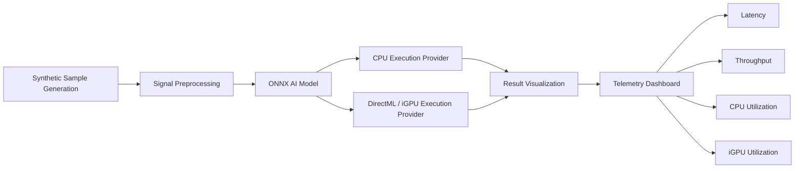

# Edge AI Screening Tools Demo

> Demonstrating AI-accelerated sample processing using Intel® CPUs and Integrated GPUs (iGPU)


---

## Overview

The Edge AI Screening Tools Demo showcases a simplified diagnostic workflow running entirely at the edge. The application simulates high-throughput sample processing using synthetic PCR-style amplification curves and a lightweight ONNX inference model.

This demonstration illustrates how Intel® CPU and integrated GPU acceleration can be leveraged to execute AI workloads locally without cloud connectivity while providing real-time visualization of processing performance.

### Key Benefits

- Local AI inference with no cloud dependency
- Real-time throughput and latency visualization
- Intel® CPU and iGPU acceleration comparison
- High-throughput screening workflow simulation
- Executive-friendly demonstration of edge AI capabilities
- Safe for public demonstrations (no patient data)

---

## Architecture Overview



---

## End-to-End Processing Flow

### 1. Sample Generation

The demo generates synthetic amplification curves that mimic PCR-style measurements observed in molecular diagnostic systems.

### 2. Signal Preprocessing

Processing includes normalization, tensor creation, batch preparation, and input formatting.

### 3. AI Inference

| Feature | Description |
|----------|------------|
| Input | PCR-like amplification curve |
| Framework | ONNX Runtime |
| Architecture | Single GEMM neural network |
| Output Classes | Positive, Negative, Inconclusive |
| Purpose | Inference benchmarking and visualization |

### 4. Hardware Acceleration

#### CPU Mode
Uses `CPUExecutionProvider`.

#### Intel® iGPU Mode
Uses `DirectMLExecutionProvider`.

---

## User Interface

The dashboard continuously displays:

- Sample processing status
- Amplification curve visualization
- Predicted sample classification
- Batch processing throughput
- End-to-end latency
- CPU utilization
- Integrated GPU utilization

---

## Demo Modes

### Standard Mode
Represents normal laboratory workflow conditions.

### Surge Mode
Simulates peak-volume processing environments.

### CPU-Only Mode
Provides baseline measurements for acceleration comparisons.

---

## Mapping to Real Analyzer Workflows

| Demo Workflow | Diagnostic Analyzer Equivalent |
|---------------|-------------------------------|
| Synthetic Amplification Curves | Fluorescence Signal Measurements |
| Signal Preprocessing | Baseline Correction & Filtering |
| ONNX Inference Engine | Detection & Classification Logic |
| Batch Processing | High-Throughput Sample Handling |
| CPU/iGPU Metrics | Instrument Compute Monitoring |
| Throughput Dashboard | Operational Performance Reporting |

### Conceptual Workflow

```text
Sample
  ↓
Signal Acquisition
  ↓
Signal Conditioning
  ↓
AI Inference
  ↓
Result Classification
```

---

## Performance Metrics

- Throughput
- Latency
- CPU Utilization
- iGPU Utilization

---

## Why This Demo Matters

✅ Local AI inference without cloud infrastructure

✅ Integrated graphics acceleration for diagnostic-style workloads

✅ Scalable edge AI processing

✅ Foundation for next-generation screening and diagnostic solutions

---

## Screenshots

```text
docs/images/dashboard.png
docs/images/amplification_curves.png
docs/images/performance_dashboard.png
```

---

## Repository Structure

```text
├── model/
├── assets/
├── dist/
├── build/
└── README.md
```

---

## Future Enhancements

- OpenVINO support
- NPU acceleration comparisons
- Additional screening workloads
- Multi-instrument simulation

---

## Disclaimer

This application is intended solely for technology demonstration and performance characterization.

- No patient data is used.
- Generated signals are synthetic.
- Results are not clinically meaningful.
- The model is not intended for medical diagnosis.

---

## License

Copyright (c) Intel Corporation.
